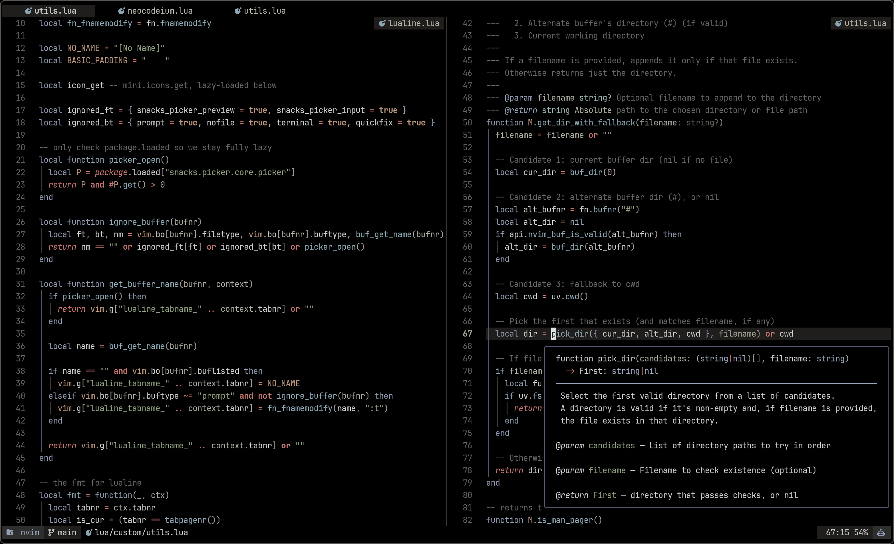

# Neovim Configuration

My Neovim configuration based on [LazyVim](https://www.lazyvim.org), with added
plugins and to extend functionality.



## Cool Things

Some cool things in this config are:

- my [custom tabline](./lua/custom/tabline.lua)
- my minimal [lualine](./lua/plugins/lualine.lua) config
- my [mini.files config](./lua/plugins/mini-files.lua)
- better word motions with [nvim-spider](./lua/plugins/spider.lua)
- my custom (borrowed/extended) [color scheme](./colors/macro.lua)
- [flatten](https://github.com/willothy/flatten.nvim) nested neovim instances
  - super useful when used with the Snacks terminal + zoxide + fzf
- [my auto commands](./lua/config/autocmds.lua) and [keymaps](./lua/config/keymaps.lua)
  - remove trailing white space on save
  - only show cursor line in active window
  - `<C-l>` in insert mode to auto fix last spelling error
  - `E` and `B` instead of `0` and `$` (wrap friendly)
  - Shift modifiers for window navigation commands work through terminal mode
  - increment/decrement numbers with `+` and `-`
  - `<C-S-C>` to get word count
  - `<C-S-S>` to clean Windows generated `^M` chars
- [my markdown config](./lua/plugins/markdown.lua)
  - follow all types of links with `<CR>`
  - render things nicely, generate TOC, etc
- my snacks.nvim [picker](./lua/plugins/picker.lua) and [terminal](./lua/plugins/terminal.lua) config
- the ~31ms startup time

> [!NOTE]
> Many of the plugins I use are not visible in `lua/plugins/` because I use the
> LazyVim distribution which already comes with lots of plugins. I have disabled
> some plugins that come with LazyVim in the [overrides.lua](./lua/plugins/overrides.lua) file.

## Dependencies

> [!WARNING]
> see [my dotfiles](https://www.github.com/n-crespo/dotfiles) for full system requirements

- `gcc`
- `python`
- `clang`
- `node`
- `go`
- `ripgrep` (may be `rg` in your package manager)
- `lazygit`
- `wslu` (if using WSL)
- `xclip` (if using WSL)
- `npm` (for some language servers)

## Install Instructions

```bash
# get nightly
sudo apt install -y software-properties-common
sudo add-apt-repository -y ppa:neovim-ppa/unstable
sudo apt update
sudo apt install -y neovim # just do this line to get stable version
```

or

```bash
brew install neovim # can add --HEAD to get nightly
```

Clone the repository and install the plugins:

```bash
git clone git@github.com:n-crespo/nvim-config ~/.config/n-crespo/nvim-config
NVIM_APPNAME=n-crespo/nvim-config/ nvim --headless +"Lazy! sync" +qa
```

Open Neovim with this config:

```bash
NVIM_APPNAME=n-crespo/nvim-config/ nvim
```
