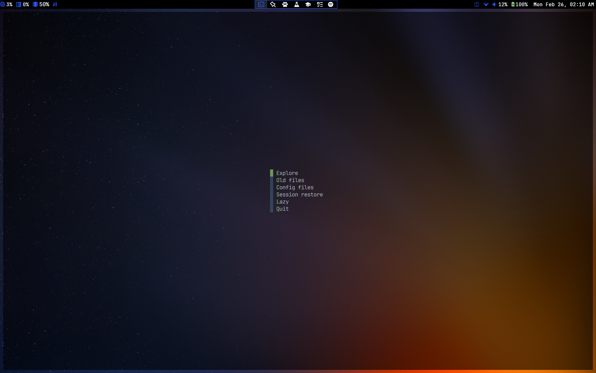

# Neovim Configuration

<a href="https://dotfyle.com/n-crespo/nvim-config"></a>
<a href="https://dotfyle.com/n-crespo/nvim-config"></a>
<a href="https://dotfyle.com/n-crespo/nvim-config"></a>

My Neovim configuration based on [LazyVim](https://www.lazyvim.org), with added plugins and LSPs to extend its
functionality. Every configuration was done with transparency in mind.

  

## Interesting Things

My favorite things about this configuration are (in no particular order):

* the 90% of [LazyVim](https://www.lazyvim.org) that I don't have disabled
* the keymaps in [keymaps.lua](./lua/config/keymaps.lua)
* the ~25 ms startup time (more like 60ms in regular Windows)
  * see the last 2 auto commands in [here](./lua/config/autocmds.lua) to speed up WSL
* the following plugins:
  * [codeium](https://github.com/Exafunction/codeium.vim) (free and open source code completion) (installed with `:LazyExtras`)
  * [spider](https://github.com/chrisgrieser/nvim-spider) (better `w`, `e`, and `b`)
  * [origami](https://github.com/chrisgrieser/nvim-origami) (`h` and `l` for folding instead of `za`)
  * [mini.files](https://github.com/echasnovski/mini.files) (less intrusive version of oil.nvim)
  * [flash.nvim](https://github.com/folke/flash.nvim) (super fast navigation)
  * [cokeline](https://github.com/willothy/nvim-cokeline) (clean, hackable tabline that i didn't hack at all)
  * [mini.indentscope](https://github.com/echasnovski/mini.indentscope) (with an instant animation)
  * [highlight-undo](https://github.com/tzachar/highlight-undo.nvim) (surprisingly very useful)
  * [betterTerm](https://github.com/CRAG666/betterTerm.nvim) (better `:term`)
  * [flatten.nvim](https://github.com/willothy/flatten.nvim) (no more nested nvim instances, amazing when used with autojump and betterTerm)
  * [onedarkpro](https://github.com/olimorris/onedarkpro.nvim) (transparent everything + super customizable)
* LSP and formatter support for R-markdown, C++, Java, and Python (mostly thanks to LazyVim)
  * see [markdown.lua](./lua/plugins/markdown.lua) and [markdowntable.lua](./lua/plugins/markdowntable.lua) for an amazing markdown editing experience (no LSP needed)

> [!Note]
> Many of the plugins I use are not visible in `lua/plugins/` because I
> use the LazyVim distribution which already comes with lots of plugins. You can
> see these in the [LazyVim repo](https://github.com/LazyVim/LazyVim). I also
> have disabled some plugins that come with LazyVim in the
> [overrides.lua](./lua/plugins/overrides.lua) file.

## Structure

This configuration is structured so that:

1) Vim specific configurations are in the
  `./lua/config/` folder  in the same way preconfigured LazyVim is structured, and

2) All plugin configurations are in the `./lua/plugins/` folder, with each
   plugin having its own file. This way, I can remove a plugin by just deleting
its file. See below:

<details>
  <summary><b>File Structure</b></summary>

```txt
.
├── ftplugin
│  ├── java.lua
│  └── markdown.lua
├── lua
│  ├── config
│  │  ├── autocmds.lua
│  │  ├── keymaps.lua
│  │  ├── lazy.lua
│  │  └── options.lua
│  ├── plugins
│  │  ├── {plugin}.lua
│  │  └── ...
│  └── transparentlualine.lua
├── init.lua
└── README.md
```

</details>

## Install Instructions

> Install requires Neovim 0.9+.

Clone the repository and install the plugins:

```sh
git clone git@github.com:n-crespo/nvim-config ~/.config/n-crespo/nvim-config
NVIM_APPNAME=n-crespo/nvim-config/ nvim --headless +"Lazy! sync" +qa
```

Open Neovim with this config:

```sh
NVIM_APPNAME=n-crespo/nvim-config/ nvim
```

## TODO

- [x] Fix transparent completion window
- [x] Edit Treesitter highlighting for markdown checkboxes
- [x] bordered floating window
- [x] bordered floating terminal
- [x] `require({})` less
- [x] transparent Lualine
- [x] transparent LSP and save dialogues (bottom right)
